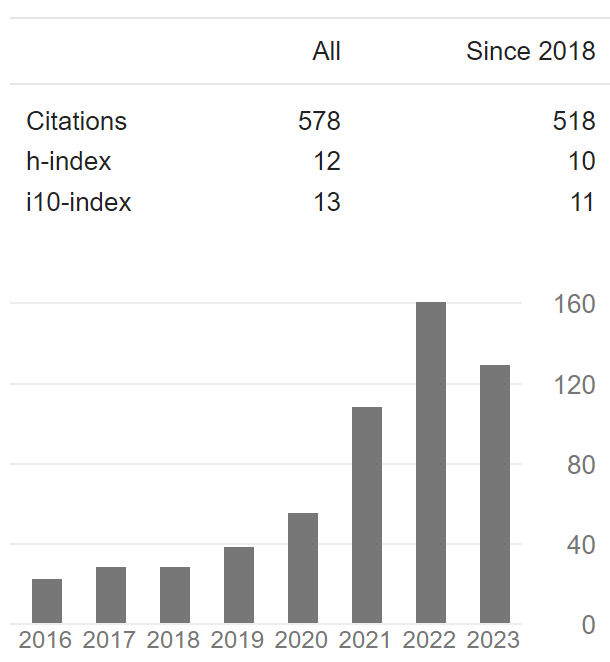

# Aside

## Contact Info {#contact}

-   <i class="fa fa-envelope"></i> xxh.med\@gmail.com
-   <i class="fa fa-envelope"></i> xin-hui.xie\@live.com
-   ORCID [0000-0002-3603-3854](https://orcid.org/0000-0002-3603-3854)
-   Google Scholar [Xin-hui Xie](https://scholar.google.com/citations?user=exF-vzUAAAAJ)

## Citation {#citation}

{width="400"}

## Skills {#skills}

-   Full experience with experiment design, and management of clinical trials, such as RCTs.

-   Experienced in clinical statistical analysis, bioinformatics, and propose new algorithms.

## Disclaimer {#disclaimer}

This resume was made with the R package [**pagedown**](https://github.com/rstudio/pagedown).

Last updated on `r Sys.Date()`.

# Main

## XIE, Xin-hui {#title}

### Currently searching for an AP/Post-doc/Scientist position

XXXXXX

## Education {data-icon="graduation-cap" data-concise="true"}

### Wuhan University

Ph.D. in Psychiatry

Wuhan, China

2021-2024

Thesis: 

### Anhui Medical University

M.S. in Psychiatry

Hefei, China

2011-2014

Thesis: Dysfunction of Visually-Guided-Saccade in Schizophrenia

### Anhui Medical University

M.D. equivalent

Hefei, China

2005-2010

## Research Experience {data-icon="landmark"}

### Psychiatrist

Department of Psychiatry,
Shenzhen Mental Health Center (Shenzhen Kangning Hospital)

Shenzhen, China

2014 - 2017

-   Investigated xxxxxx xxxx xxxx xxxxxxx xxxx xxxxx xxxxxx xxxx xxxx xxxxxxx xxxx xxxxx xxxxxx xxxx xxxx xxxxxxx xxxx xxxxx xxxxxx xxxx xxxx xxxxxxx xxxx xxxxx.
-   Investigated xxxxxx xxxx xxxx xxxxxxx xxxx xxxxx xxxxxx xxxx xxxx xxxxxxx xxxx xxxxx xxxxxx xxxx xxxx xxxxxxx xxxx xxxxx xxxxxx xxxx xxxx xxxxxxx xxxx xxxxx.
-   Investigated xxxxxx xxxx xxxx xxxxxxx xxxx xxxxx xxxxxx xxxx xxxx xxxxxxx xxxx xxxxx xxxxxx xxxx xxxx xxxxxxx xxxx xxxxx xxxxxx xxxx xxxx xxxxxxx xxxx xxxxx.

### Director (Full-time)

Brain Function and Psychosomatic Medicine Institute,
Huizhou Mental Health Center (Second People’s Hospital of Huizhou)

Huizhou, China

2017 - 2021 

-   Investigated xxxxxx xxxx xxxx xxxxxxx xxxx xxxxx xxxxxx xxxx xxxx xxxxxxx xxxx xxxxx xxxxxx xxxx xxxx xxxxxxx xxxx xxxxx xxxxxx xxxx xxxx xxxxxxx xxxx xxxxx.
-   Investigated xxxxxx xxxx xxxx xxxxxxx xxxx xxxxx xxxxxx xxxx xxxx xxxxxxx xxxx xxxxx xxxxxx xxxx xxxx xxxxxxx xxxx xxxxx xxxxxx xxxx xxxx xxxxxxx xxxx xxxxx.
-   Investigated xxxxxx xxxx xxxx xxxxxxx xxxx xxxxx xxxxxx xxxx xxxx xxxxxxx xxxx xxxxx xxxxxx xxxx xxxx xxxxxxx xxxx xxxxx xxxxxx xxxx xxxx xxxxxxx xxxx xxxxx.

### Director (Part-time)

Brain Function and Psychosomatic Medicine Institute,
Huizhou Mental Health Center (Second People’s Hospital of Huizhou)

Huizhou, China

2021 - Now 

-   Investigated xxxxxx xxxx xxxx xxxxxxx xxxx xxxxx xxxxxx xxxx xxxx xxxxxxx xxxx xxxxx xxxxxx xxxx xxxx xxxxxxx xxxx xxxxx xxxxxx xxxx xxxx xxxxxxx xxxx xxxxx.
-   Investigated xxxxxx xxxx xxxx xxxxxxx xxxx xxxxx xxxxxx xxxx xxxx xxxxxxx xxxx xxxxx xxxxxx xxxx xxxx xxxxxxx xxxx xxxxx xxxxxx xxxx xxxx xxxxxxx xxxx xxxxx.
-   Investigated xxxxxx xxxx xxxx xxxxxxx xxxx xxxxx xxxxxx xxxx xxxx xxxxxxx xxxx xxxxx xxxxxx xxxx xxxx xxxxxxx xxxx xxxxx xxxxxx xxxx xxxx xxxxxxx xxxx xxxxx.

## Professional Experience {data-icon="suitcase"}

## Professional Experience {data-icon="landmark"}

### Data Scientist, intern

xxx Inc.

xxx, China

2014

::: concise
-   Taught R language to beginners.
-   Wrote Shiny app demos.
-   Converted statistical tutorials from SPSS to R language.
:::

### Bioinformatician

My Health Gene Technology Co., Ltd.

Beijing, China

2015 - 2016

::: concise
-   Analyzed whole-exome sequencing data.
-   Wrote analysis pipelines of ChIP-seq, single cell DNA-seq and single cell RNA-seq.
-   Studied tumor metastasis and wrote research reports.
-   Also did case studies to identify the genetic defect causing rare disease.
:::

## Teaching Experience {data-icon="chalkboard-teacher"}

### Introduction to R Language for Beginners.

Instructor of R and Data Mining Training Courses at SupStat Inc.

Beijing, China

2014

### Computational Biology and Bioinformatics.

Teaching assistant of GBS CB2-201 courses at UAB

AL, USA

2016 - 2017

## Selected Publications and Posters {data-icon="file"}

### Genetic and epigenetic signals are found predictive to the distribution of intra-individual divergence of alternative splicing.

Poster for 2013 International Conference of Genomics

Qingdao, China

2014

**Yu L**, Chen B, Zhang Z.

### ESCRT-0 complex modulates Rbf mutant cell survival by regulating Rhomboid endosomal trafficking and EGFR signaling.

J Cell Sci. 2016 May 15;129(10):2075-84.

N/A

2016

Sheng Z, **Yu L**, Zhang T, Pei X, Li X, Zhang Z and Du W.
