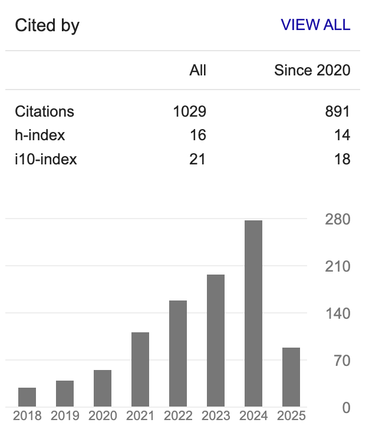

# Aside

## Contact Info {#contact}

-   <i class="fa fa-envelope"></i> xxh.med\@gmail.com
-   <i class="fa fa-envelope"></i> xin-hui.xie\@live.com
-   ORCID: [0000-0002-3603-3854](https://orcid.org/0000-0002-3603-3854)
-   Google Scholar: [Xin-hui Xie](https://scholar.google.com/citations?user=exF-vzUAAAAJ)

## 

Last updated on `r format(Sys.Date(), "%b %d, %Y")`.

## Skills

**Study design**: Full experience in trial designing and managing clinical trials, including randomized controlled trials (RCTs).

**Leadership**: Experience in leading and motivating 2-3 research teams of about 5-20 members.

**Data analyses**: Experience in conducting clinical statistical analyses. Also proficient in high-throughput omics analysis, such as microbiome, proteomics, transcriptomics, lipidomics, and single-cell genomics.

# Main

## XIE, Xin-hui {#title}

### Currently seeking an Assistant Professor, Postdoctoral Researcher, Scientist, or other scientific position.

The complexities of the central nervous system (CNS) present challenges in studying neuro-psychiatric disorders. **A recent approach that enriches brain-derived extracellular vesicles (BDEVs) from peripheral blood offers direct *in vivo* CNS data, bypassing the blood-brain barrier, like the "[*New windows into the brain*](https://doi.org/10.1016/j.pneurobio.2019.01.005)"**. However, **for rapidly changing CNS disorders,** according to the [*Nyquist-Shannon sampling theorem*](https://en.wikipedia.org/wiki/Nyquist%E2%80%93Shannon_sampling_theorem)*,* **the routine frequency of sample collection (semi-annually or annually) is insufficient to capture the detailed trajectories of molecular signals**, and clearly, daily sampling of blood or cerebrospinal fluid from subjects is out of the question.

In response, **I innovated a novel method for isolating BDEVs from urine. This method allows for non-invasive and frequent, even semi-daily, collection of *in vivo* CNS signals** (*The 23rd WPA World Congress of Psychiatry, #4041*). This **urinary BDEV (uBDEV)** approach has the potential to **delineate intricate trajectories of CNS-specific molecular signals at the individual level**, as shown in the schematic diagram below. I believe that, this new method could provide a valuable tool for research on CNS diseases, especially those that change rapidly.

As I will obtain a Ph.D. degree in 2024, I am now motivated to secure a position that will allow me to use my method and other skills and expertise to extensively explore neuro-psychiatric disorders. **I am particularly interested in the following aspects of neuro-psychiatric disorders: uncovering new biological markers, potentially identifying new diseases, elucidating their underlying mechanisms, developing diagnostic tools, and improving treatment strategies**.

## Education {data-icon="graduation-cap" data-concise="true"}

### Wuhan University

Ph.D. candidate in Psychiatry

Wuhan, China

2021 - 2024

Main research contents:

Investigating the status of neuroinflammation and neurogenesis in patients with major depressive disorder (MDD) using plasma/serum astrocyte-derived extracellular vesicles (ADEVs) and neuro-derived EVs (NDEVs), and the changes before and after electroconvulsive therapy (ECT).

Innovated a method for isolating BDEVs (ADEVs, NDEVs, and oligodendrocyte-derived EVs) from urine.

Based on the [two-hit hypothesis of depression](https://doi.org/10.1002/wps.20556), I developed a new rat model that has the advantages of stable modeling effect and can better simulate the damage of neural synapses and neurotransmitter pathways such as GABA in patients with depression.

### Anhui Medical University

M.S. in Psychiatry.

Hefei, China

2011 - 2014

Main research contents:

I designed an algorithm termed the asymmetric acceleration index (AAI) to compute the asymmetry of saccade acceleration. I found that schizophrenia patients had a significantly lower correlation coefficient (RAD) between AAI and saccade duration than healthy controls ([*Cui et al., 2014*](https://doi.org/10.1371/journal.pone.0097308)).

### Anhui Medical University

M.D. equivalent

Hefei, China

2005 - 2010

## Professional Experience {data-icon="landmark"}

### Director (Full-time (2017-2021)/Part-time (2021-Now))

Brain Function and Psychosomatic Medicine Institute, Huizhou Mental Health Center (Second People's Hospital of Huizhou)

Huizhou, China

2017 - Now

Main research contents:

-   **Improved electroconvulsive therapy (ECT) with similar efficacy but reduced side effects**: Hybrid-ECT ([*Rong et al., 2019*]((https://doi.org/10.1186/s12888-019-2320-3))), a pioneering approach combining efficacy of standard ECT with reduced cognitive side effects ([*Li et al., 2021*](https://doi.org/10.1016/j.brs.2021.04.017); [*Zhang et al., 2022*](https://doi.org/10.3389/fpsyt.2022.896018)). And further evolved into i-HECT, currently in progress.
-   **Schizophrenia and CAC**: Uncovered increased coronary artery calcium (CAC) in schizophrenia patients through COVID-19 chest CT analysis ([*Huang et al., 2021*](https://doi.org/10.1016/j.schres.2021.03.002)). Identified potential risk factors including elevated triglycerides and decreased Triiodothyronine (manuscript under review).
-   **Gut Microbiota in Mood Disorders**: Explored gut microbiota in patients with major depressive or bipolar disorder, highlighting distinctive microbiota patterns and links to the gut microbial tryptophan biosynthesis and metabolism pathway (MiTBamp)([*Rong et al., 2019*](https://doi.org/10.1016/j.jpsychires.2019.03.017); *Lai et al., 2021 [a](https://doi.org/10.1017/s0033291719003027) & [b](https://doi.org/10.1016/j.jad.2020.09.010)*).
-   **Additional Research Endeavors**: Conducted a meta-analysis of MRI network topology in depression patients. ([*Xu et al., 2021*](https://doi.org/10.1016/j.jad.2021.08.120)).

### Resident Psychiatrist

Shenzhen Mental Health Center (Shenzhen Kangning Hospital)

Shenzhen, China

2014 - 2017

-   Residency training program.

## Publications {data-icon="dna"}

### (Note: #First author, \*Corresponding author)

N/A

N/A

N/A

### **ORAL: ISOLATING URINARY ASTROCYTE-DERIVED EXTRACELLULAR VESICLES (UADEVS): A NOVEL HIGH-FREQUENCY AND NON-INVASIVE "LIQUID-BIOPSY" APPROACH TO STUDYING CNS DISEASES**

*The 23rd WPA World Congress of Psychiatry*

Vienna, Austria

2023

[**Xie, X. H.#\***]{.underline}, Chen, M.M., Xu, S.X., Mei, J., Song, X.H., Liu, Z.

### **ORAL: NEUROGENESIS HYPOTHESIS OF DEPRESSION AND ELECTROCONVULSIVE THERAPY (ECT): HUMAN IN VIVO EVIDENCE FROM PLASMA NEURON-DERIVED EXTRACELLULAR VESICLES (NDEVS)**

*The 23rd WPA World Congress of Psychiatry*

Vienna, Austria

2023

[**Xie, X. H.#\***]{.underline}, Xu, S., Yao, L.H., Chen, M.M. Liu, Z.

### **ORAL:MISFORTUNES NEVER COME SINGLY: A NOVEL RAT MODEL OF DEPRESSION BASED ON THEINSOMNIA-INFLAMMATION TWO-HIT HYPOTHESIS**

*The 23rd WPA World Congress of Psychiatry*

Vienna, Austria

2023

Mei, J.#, Song,X.#, [**Xie, X. H.**]{.underline}, Wang, Y. , Wang, G., Chen, C., Xu, S.X., Zhang, H., Chen, G., Liu, Z.\*

### Trajectories of Efficacy and Cognitive Function During Electroconvulsive Therapy Course in Young Adults with Treatment-Resistant Depression.

*Neuropsychiatric disease and treatment*, 19, 267--281. [DOI](https://doi.org/10.2147/ndt.s394155) [PMID](https://pubmed.ncbi.nlm.nih.gov/36744206/)

N/A

2023

Xu, S. X.#, [**Xie, X. H.#**]{.underline}, Yao, L., Chen, L. C., Wan, Q., Chen, Z. H., & Liu, Z.\*

### Young Adults with Major Depression Show Altered Microbiome.

*Neuroscience*, 522, 23--32. [DOI](https://doi.org/10.1016/j.neuroscience.2023.05.002) [PMID](https://pubmed.ncbi.nlm.nih.gov/37169166/)

N/A

2023

Chen, M. M.#, Wang, P., [**Xie, X. H.**]{.underline}, Nie, Z., Xu, S. X., Zhang, N., Wang, W., Yao, L., & Liu, Z.\*

### Nicotinamide ameliorates mitochondria-related neuronal apoptosis and cognitive impairment via the NAD+/SIRT3 pathway.

*Schizophrenia (Heidelberg, Germany)*, 9(1), 32. [DOI](https://doi.org/10.1038/s41537-023-00357-w) [PMID](https://pubmed.ncbi.nlm.nih.gov/37210391/)

N/A

2023

Hao, K.#, Chen, F.#, Zhao, L.#, Xu, S., Xiong, Y., Xu, R., [**Xie, X. H.**]{.underline}, Huang, H., Shu, C., Liu, Z., Wang, H.\*, & Wang, G.\*

### Assessment of brain imaging and cognitive function in a modified rhesus monkey model of depression.

*Behavioural brain research*, 445, 114382. [DOI](https://doi.org/10.1016/j.bbr.2023.114382) [PMID](https://pubmed.ncbi.nlm.nih.gov/36871905/)

N/A

2023

Chen, G.#, Ma, S.#, Gong, Q.#, [**Xie, X. H.**]{.underline}, Wu, P., Guo, W., Kang, L., Li, M., Zhang, H., Zhou, E., Zhang, Y., Rong, J., Duan, H., Jin, L., Xu, S., Zhang, N., Sun, S., Li, R., Yao, L., Xiang, D., ... Liu, Z.\*

### Inflammatory bowel disease and the long-term risk of depression: A prospective cohort study of the UK biobank.

*General hospital psychiatry*, 82, 26--32. [DOI](https://doi.org/10.1016/j.genhosppsych.2023.03.002) [PMID](https://pubmed.ncbi.nlm.nih.gov/36924701/)

N/A

2023

Ma, S.#, Wang, W., Gong, Q., Xiang, D., Yao, L., Xu, S., [**Xie, X. H.**]{.underline}, Wang, H., Wang, G., Yang, J., & Liu, Z.\*

### A Cross-Sectional Study: Structural and Related Functional Connectivity Changes in the Brain: Stigmata of Adverse Parenting in Patients with Major Depressive Disorder?

*Brain sciences*, 13(4), 694. [DOI](https://doi.org/10.3390/brainsci13040694) [PMID](https://pubmed.ncbi.nlm.nih.gov/37190659/)

N/A

2023

Nie, Z., [**Xie, X. H.**]{.underline}, Kang, L., Wang, W., Xu, S., Chen, M., Yao, L., Gong, Q., Zhou, E., Li, M., Wang, H., Bu, L., & Liu, Z.\*

### Hyper-inflammation of Astrocytes in Patients of Major Depressive Disorder: Evidence from Serum Astrocyte-derived Extracellular Vesicles.

*Brain, behavior, and immunity*, 109, 51--62. [DOI](https://doi.org/10.1016/j.bbi.2022.12.014) [PMID](https://pubmed.ncbi.nlm.nih.gov/36587855/)

N/A

2023

[**Xie, X. H.#**]{.underline}, Lai, W. T., Xu, S. X., Forti, M. D., Zhang, J. Y., Chen, M. M., Yao, L. H., Wang, P. L., Hao, K. K., & Han, R.\*

### Measuring childhood trauma in young adults with depression: A latent profile analysis.

*Asian journal of psychiatry*, 109, 51--62. [DOI](https://doi.org/10.1016/j.ajp.2022.103387) [PMID](https://pubmed.ncbi.nlm.nih.gov/36525765/)

N/A

2022

Wang, P.#, [**Xie, X. H.**]{.underline}, Chen, M., Zhang, N., Wang, W., Ma, S., Nie, Z., Yao, L., & Liu, Z.\*

### The relationship between vitamin D levels in seasonal variations and Chinese patients with first-episode drug-naive depression.

*Journal of psychosomatic research*, 164, 111079. [DOI](https://doi.org/10.1016/j.jpsychores.2022.111079) [PMID](https://pubmed.ncbi.nlm.nih.gov/36402037/)

N/A

2022

Yao, L.#, Zhang, N., Ma, S., [**Xie, X. H.**]{.underline}, Xu, S., Xiang, D., Kang, L., Chen, M. M., Wang, P., & Liu, Z.\*

### Nicotinamide reverses deficits in puberty-born neurons and cognitive function after maternal separation.

*Journal of neuroinflammation*, 19(1), 232. [DOI](https://doi.org/10.1186/s12974-022-02591-y) [PMID](https://pubmed.ncbi.nlm.nih.gov/36131290/)

N/A

2022

Hao, K.#, Wang, H.#, Zhang, Y.#, [**Xie, X. H.**]{.underline}, Huang, H., Chen, C., Xu, S., Xu, R., Shu, C., Liu, Z., Zhou, Y., Reynolds, G. P., & Wang, G.\*

### Electroconvulsive Therapy in a Young Adult Patient With Bipolar Depression and Dysembryoplastic Neuroepithelial Tumor: A Case Report.

*The journal of ECT*, 10.1097/YCT.0000000000000876. [DOI](https://doi.org/10.1097/yct.0000000000000876) [PMID](https://pubmed.ncbi.nlm.nih.gov/35917211/)

N/A

2022

Xu, S. X.#, [**Xie, X. H.#**]{.underline}, Su, D., & Liu, Z.\*

### Analysis of Psychological and Gut Microbiome Characteristics in Patients With Non-erosive Reflux Disease.

*Frontiers in psychiatry*, 12, 741049. [DOI](https://doi.org/10.3389/fpsyt.2021.741049) [PMID](https://pubmed.ncbi.nlm.nih.gov/35095588/)

N/A

2022

Yang, F.#, [**Xie, X. H.#**]{.underline}, Li, X., Liao, H. N., & Zou, B.\*

### Functional Connectivity Features of Resting-State Functional Magnetic Resonance Imaging May Distinguish Migraine From Tension-Type Headache.

*Frontiers in neuroscience*, 16, 851111. [DOI](https://doi.org/10.3389/fnins.2022.851111) [PMID](https://pubmed.ncbi.nlm.nih.gov/35557602/)

N/A

2022

Wang, Y.#, Wang, Y., Bu, L., Wang, S., [**Xie, X. H.**]{.underline}, Lin, F., & Xiao, Z.\*

### Improved Safety of Hybrid Electroconvulsive Therapy Compared With Standard Electroconvulsive Therapy in Patients With Major Depressive Disorder: A Randomized, Double-Blind, Parallel-Group Pilot Trial.

*Frontiers in psychiatry*, 13, 896018. [DOI](https://doi.org/10.3389/fpsyt.2022.896018) [PMID](https://pubmed.ncbi.nlm.nih.gov/35677877/)

N/A

2022

Zhang, J. Y.#, Xu, S. X.#, Zeng, L.#, Chen, L. C., Li, J., Jiang, Z. Y., Tan, B. J., Gu, C. L., Lai, W. T., Kong, X. M., Wang, J., Rong, H., & [**Xie, X. H.*\****]{.underline}

### The integrated understanding of structural and functional connectomes in depression: A multimodal meta-analysis of graph metrics.

*Journal of affective disorders*, 295, 759--770. [DOI](https://doi.org/10.1016/j.jad.2021.08.120) [PMID](https://pubmed.ncbi.nlm.nih.gov/34517250/)

N/A

2021

Xu, S. X.#, Deng, W. F.#, Qu, Y. Y.#, Lai, W. T., Huang, T. Y., Rong, H., & [**Xie, X. H.*\****]{.underline}

### The prevalence and independent influencing factors of obesity and underweight in patients with schizophrenia: a multicentre cross-sectional study.

*Eating and weight disorders: EWD*, 26(5), 1365--1374. [DOI](https://doi.org/10.1007/s40519-020-00920-9) [PMID](https://pubmed.ncbi.nlm.nih.gov/32557379/)

N/A

2021

Wang, J.#, Zhang, Y., Yang, Y., Liu, Z., Xia, L., Li, W., Li, Z., [**Xie, X. H.**]{.underline}, Deng, W., Zhang, K., & Liu, H.\*

### Higher prevalence of coronary artery calcification in schizophrenia patients.

*Schizophrenia research*, 231, 47--48. [DOI](https://doi.org/10.1016/j.schres.2021.03.002) [PMID](https://pubmed.ncbi.nlm.nih.gov/33752106/)

N/A

2021

Huang, T. Y.#, Deng, W. F.#, Li, X. P., Chen, H. Q., Xu, S. X., Ke, S. H., & [**Xie, X. H.*\****]{.underline}

### The efficacy and acceptability of hybrid electroconvulsive therapy compared with standard electroconvulsive therapy for schizophrenia patients: A parallel-group, double-blind, randomized, controlled trial.

*Brain stimulation*, 14(3), 737--739. [DOI](https://doi.org/10.1016/j.brs.2021.04.017) [PMID](https://pubmed.ncbi.nlm.nih.gov/33962078/)

N/A

2021

Li, J.#, Deng, W. F.#, Xu, S. X.#, Jiang, Z. Y., Rong, H., Kong, X. M., & [**Xie, X. H.*\****]{.underline}

### Shotgun metagenomics reveals both taxonomic and tryptophan pathway differences of gut microbiota in bipolar disorder with current major depressive episode patients.

*Journal of affective disorders*, 278, 311--319. [DOI](https://doi.org/10.1016/j.jad.2020.09.010) [PMID](https://pubmed.ncbi.nlm.nih.gov/32979562/)

N/A

2021

Lai, W. T.#, Zhao, J.#, Xu, S. X.#, Deng, W. F.#, Xu, D., Wang, M. B., He, F. S., Liu, Y. H., Guo, Y. Y., Ye, S. W., Yang, Q. F., Zhang, Y. L., Wang, S., Li, M. Z., Yang, Y. J., Liu, T. B., Tan, Z. M., [**Xie, X. H.*\****]{.underline}, & Rong, H.\*

### Shotgun metagenomics reveals both taxonomic and tryptophan pathway differences of gut microbiota in major depressive disorder patients.

*Psychological medicine*, 51(1), 90--101. [DOI](https://doi.org/10.1017/s0033291719003027) [PMID](https://pubmed.ncbi.nlm.nih.gov/31685046/)

N/A

2021

Lai, W. T.#, Deng, W. F.#, Xu, S. X.#, Zhao, J., Xu, D., Liu, Y. H., Guo, Y. Y., Wang, M. B., He, F. S., Ye, S. W., Yang, Q. F., Liu, T. B., Zhang, Y. L., Wang, S., Li, M. Z., Yang, Y. J., [**Xie, X. H.*\****]{.underline}, & Rong, H.\*

### 眼脑联动与神经精神疾病[Initiative of eye-brain joint computing in neuropsychiatric disorders].

*中华精神科杂志*,053(006), 546-552. [DOI](https://doi.org/10.3760/cma.j.cn113661-20200318-00123)

N/A

2020

[**谢新晖 (Xie, X. H.)\#**]{.underline}, Bang Chen#, 赵一天, 王浩, 徐淑娴, 胡衍, 荣晗*,* 刘江\*

### Short-term effects of air pollution on cause-specific mental disorders in three subtropical Chinese cities.

*Environmental research*, 191, 110214. [DOI](https://doi.org/10.1016/j.envres.2020.110214) [PMID](https://pubmed.ncbi.nlm.nih.gov/32946889/)

N/A

2020

Li, H.#, Zhang, S., Qian, Z. M., [**Xie, X. H.**]{.underline}, Luo, Y., Han, R., Hou, J., Wang, C., McMillin, S. E., Wu, S., Tian, F., Deng, W. F.\*, & Lin, H.\*

### The effect of temperature on cause-specific mental disorders in three subtropical cities: A case-crossover study in China.

*Environment international*, 143, 105938. [DOI](https://doi.org/10.1016/j.envint.2020.105938) [PMID](https://pubmed.ncbi.nlm.nih.gov/32688157/)

N/A

2020

Zhang, S.#, Yang, Y., [**Xie, X. H.**]{.underline}, Li, H., Han, R., Hou, J., Sun, J., Qian, Z. M., Wu, S., Huang, C., Howard, S. W., Tian, F., Deng, W., & Lin, H.\*

### Study protocol for a parallel-group, double-blinded, randomized, controlled, noninferiority trial: the effect and safety of hybrid electroconvulsive therapy (Hybrid-ECT) compared with routine electroconvulsive therapy in patients with depression.

*BMC psychiatry*, 19(1), 344. [DOI](https://doi.org/10.1186/s12888-019-2320-3) [PMID](https://pubmed.ncbi.nlm.nih.gov/31694611/)

N/A

2019

Rong, H.#, Xu, S. X.#, Zeng, J.#, Yang, Y. J., Zhao, J., Lai, W. T., Chen, L. C., Deng, W. F., Zhang, X., Zhang, Y. L., Li, M. Z., Xiao, L., & [**Xie, X. H.*\****]{.underline}

### Low-Charge Electrotherapy in Geriatric Major Depressive Disorder Patients: A Case Series.

*Psychiatry investigation*, 16(6), 464--468. [DOI](https://doi.org/10.30773/pi.2019.03.21.1) [PMID](https://pubmed.ncbi.nlm.nih.gov/31247706/)

N/A

2019

Kong, X. M.#, [**Xie, X. H.**]{.underline}, Xu, S. X., Chen, Y., Wang, C., Hong, H., & Sun, Y.\*

### Similarly in depression, nuances of gut microbiota: Evidences from a shotgun metagenomics sequencing study on major depressive disorder versus bipolar disorder with current major depressive episode patients.

*Journal of psychiatric research*, 113, 90--99. [DOI](https://doi.org/10.1016/j.jpsychires.2019.03.017) [PMID](https://pubmed.ncbi.nlm.nih.gov/30927646/)

N/A

2019

Rong, H.#, [**Xie, X. H.#**]{.underline}, Zhao, J., Lai, W. T., Wang, M. B., Xu, D., Liu, Y. H., Guo, Y. Y., Xu, S. X., Deng, W. F., Yang, Q. F., Xiao, L., Zhang, Y. L., He, F. S., Wang, S., & Liu, T. B.\*

### Low-charge electrotherapy for patients with schizophrenia: A double-blind, randomised controlled pilot clinical trial.

*Psychiatry research*, 272, 676--681. [DOI](https://doi.org/10.1016/j.psychres.2018.12.143) [PMID](https://pubmed.ncbi.nlm.nih.gov/30616140/)

N/A

2019

Li, M. Z.#, Chen, L. C.#, Rong, H., Xu, S. X., Li, Y., Yang, Q. F., Deng, W. F., Yang, H. Z., Kong, X. M., Xiao, L., & [**Xie, X. H.*\****]{.underline}

### Electroconvulsive therapy changes the regional resting state function measured by regional homogeneity (ReHo) and amplitude of low frequency fluctuations (ALFF) in elderly major depressive disorder patients: An exploratory study.

*Psychiatry research. Neuroimaging*, 264, 13--21. [DOI](https://doi.org/10.1016/j.pscychresns.2017.04.001) [PMID](https://pubmed.ncbi.nlm.nih.gov/28412557/)

N/A

2017

Kong, X. M.#, Xu, S. X.#, Sun, Y., Wang, K. Y., Wang, C., Zhang, J., Xia, J. X., Zhang, L., Tan, B. J., & [**Xie, X. H.*\****]{.underline}

### How does gaze direction affect facial processing in social anxiety? -An ERP study.

*Psychiatry research*, 251, 155--161. [DOI](https://doi.org/10.1016/j.psychres.2017.02.018) [PMID](https://pubmed.ncbi.nlm.nih.gov/28208076/)

N/A

2017

Li, D.#, Yu, F., Ye, R., Chen, X., [**Xie, X. H.**]{.underline}, Zhu, C., & Wang, K.\*

### Mindfulness-based stress reduction for chronic insomnia in adults older than 75 years: a randomized, controlled, single-blind clinical trial.

*Explore (New York, N.Y.)*, 11(3), 180--185. [DOI](https://doi.org/10.1016/j.explore.2015.02.005) [PMID](https://pubmed.ncbi.nlm.nih.gov/25843539/)

N/A

2015

Zhang, J. X.#, Liu, X. H.#, [**Xie, X. H.*\****]{.underline}, Zhao, D., Shan, M. S., Zhang, X. L., Kong, X. M., & Cui, H.\*

### Efficacy and acceptability of atypical antipsychotics for the treatment of post-traumatic stress disorder: a meta-analysis of randomized, double-blind, placebo-controlled clinical trials.

*Psychiatry research*, 219(3), 543--549. [DOI](https://doi.org/10.1016/j.psychres.2014.05.027) [PMID](https://pubmed.ncbi.nlm.nih.gov/25015709/)

N/A

2014

Liu, X. H.#, [**Xie, X. H.*\****]{.underline}, Wang, K. Y., & Cui, H.\*

### Association of saccade duration and saccade acceleration/deceleration asymmetry during visually guided saccade in schizophrenia patients.

*PloS one*, e97308. [DOI](https://doi.org/10.1371/journal.pone.0097308) [PMID](https://pubmed.ncbi.nlm.nih.gov/24837253/)

N/A

2014

Cui, H.#, Liu, X. H.#, Wang, K. Y., Zhu, C. Y., Wang, C., & [**Xie, X. H.*\****]{.underline}

### Electroconvulsive therapy on severe obsessive-compulsive disorder comorbid depressive symptoms.

*Psychiatry investigation*, 11(2), 210--213. [DOI](https://doi.org/10.4306/pi.2014.11.2.210) [PMID](https://pubmed.ncbi.nlm.nih.gov/24843380/)

N/A

2014

Liu, X.#, Cui, H.#, Wei, Q., Wang, Y., Wang, K., Wang, C., Zhu, C., & [**Xie, X. H.*\****]{.underline}

### 精神分裂症患者在视觉引导眼跳中速度非对称性与眼跳幅度的相关分析. [The correlation between saccade velocity asymmetry and amplitude during visually guided saccade was lower in schizophrenia patients].

*中华精神科杂志*, (5), 5. [DOI](https://doi.org/10.3760/cma.j.issn.1006-7884.2014.05.005)

N/A

2020

[**谢新晖 (Xie, X. H.)\#**]{.underline}, 刘晓慧, 王晨, 朱春燕, 崔红, & 王克永\*

### Electroconvulsive therapy and Klinefelter syndrome.

*The journal of ECT*, 29(3), e36--e37. [DOI](https://doi.org/10.1097/yct.0b013e31828b3515) [PMID](https://pubmed.ncbi.nlm.nih.gov/23965608/)

N/A

2013

Wei, Q.#, [**Xie, X. H.#**]{.underline}, Chen, Y., Tian, Y., Wang, H., Wang, K., & Wang, K.\*
